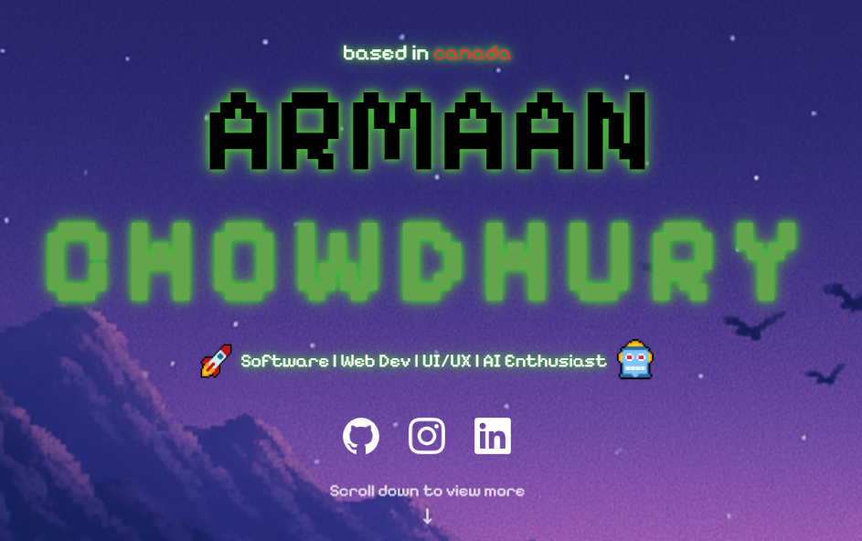

<div align="center">

# 👾 Armaan Chowdhury — Dev Portfolio

**A retro, pixel-art personal portfolio built with React, Vite, and Tailwind CSS.**

[](https://armaancs.github.io/armaan-react-portfolio/)
[](https://www.linkedin.com/in/armaan-chowdhury-2075a1337/)




</div>

---

## 📖 About

This is my personal developer portfolio. I'm a Computer Science + Statistics student at **Queen's University**, focused on machine learning, data engineering, and data science. The site uses a pixelated, synthwave-inspired look to match my interests and creative style, and showcases my tech stack, projects, education, and experience in one place.

## ✨ Features

- **Pixel-art aesthetic** using Google Fonts like *Pixelify Sans*, *Jersey 10*, and *Play*, with glowing "synth" text effects
- **Light / Dark mode toggle** that swaps the full background scene and color scheme
- **Parallax background** that shifts as you scroll down the page
- **Animated loading screen** with a fade-in transition to the main content
- **Scroll-aware sticky navbar** that appears after the hero section, with pop-up panels for *About*, *Developing*, and *Get in Touch*
- **Project carousel** with hover cards that reveal each project's description, tech stack, and GitHub link
- **Experience timeline** covering internships, design teams, hackathons, and work history
- **Responsive layout** built with Tailwind CSS utility classes

## 🗂️ Sections

| Section | What's inside |
| --- | --- |
| **Hero** | Name, tagline, social links, and profile photo |
| **Current Technologies** | Python, JavaScript, React, Node.js, AWS, SQL, pandas, scikit-learn, Power BI, Tailwind, Figma, Git, Mapbox GL JS, Turf.js, and more |
| **Developed Projects** | Hotel Revenue Dashboard, SolarAIDE, Dev Portfolio, Maze Generation Algorithm, LogozAI, Pokémon Demo |
| **Education** | Bachelor of Computing (Hons.), Minor in Statistics @ Queen's University |
| **Certifications** | Credential cards with courses, skills, and verification links, starting with the Machine Learning Specialization @ DeepLearning.AI & Stanford Online |
| **Experience** | Timeline of roles from Machine Learning Engineer @ QMIND and Data Engineer Intern @ ABEN HUB back to earlier positions |

## 🛠️ Tech Stack

- **Framework:** [React 19](https://react.dev/)
- **Build tool:** [Vite 7](https://vite.dev/)
- **Styling:** [Tailwind CSS 4](https://tailwindcss.com/) + custom CSS per component
- **Icons:** [react-icons](https://react-icons.github.io/react-icons/)
- **Linting:** ESLint
- **Hosting:** GitHub Pages via [`gh-pages`](https://www.npmjs.com/package/gh-pages)

## 📁 Project Structure

```
armaan-react-portfolio/
├── public/
├── src/
│   ├── assets/          # Images, logos, backgrounds
│   ├── App.jsx          # Root component: loader, parallax, dark mode
│   ├── Navbar.jsx       # Sticky nav with pop-up panels
│   ├── Title.jsx        # Hero section
│   ├── CurrTech.jsx     # Technologies grid
│   ├── DevProj.jsx      # Project carousel
│   ├── Education.jsx
│   ├── Certifications.jsx  # Credential cards (add new ones to the list at the top)
│   ├── Experience.jsx   # Career timeline
│   ├── Footer.jsx
│   └── main.jsx         # Entry point
├── index.html
├── vite.config.js
└── package.json
```

## 🚀 Getting Started

**Prerequisites:** [Node.js](https://nodejs.org/) (v18 or newer) and npm.

```bash
# Clone the repo
git clone https://github.com/armaancs/armaan-react-portfolio.git

# Move into the app folder
cd armaan-react-portfolio/armaan-react-portfolio

# Install dependencies
npm install

# Start the dev server
npm run dev
```

Then open the local URL Vite prints in your terminal.

### Available scripts

| Command | Description |
| --- | --- |
| `npm run dev` | Start the local dev server with hot reload |
| `npm run build` | Build for production into `dist/` |
| `npm run preview` | Preview the production build locally |
| `npm run lint` | Run ESLint |
| `npm run deploy` | Build and publish `dist/` to GitHub Pages |

## 🌐 Deployment

The site is deployed to GitHub Pages at **[armaancs.github.io/armaan-react-portfolio](https://armaancs.github.io/armaan-react-portfolio/)**. The Vite `base` path is set to `/armaan-react-portfolio` in `vite.config.js` so assets resolve correctly. To redeploy:

```bash
npm run deploy
```

## 📬 Contact

- **Email:** armchow312@gmail.com
- **LinkedIn:** [linkedin.com/in/armaan-chowdhury-2075a1337](https://www.linkedin.com/in/armaan-chowdhury-2075a1337/)
- **GitHub:** [@armaancs](https://github.com/armaancs)

---

<div align="center">
<sub>© 2026 Armaan Chowdhury. Built with React and a lot of pixels.</sub>
</div>
